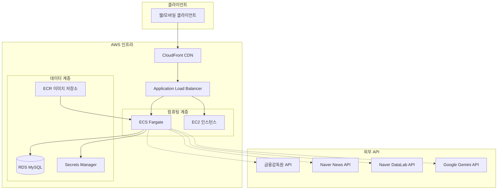
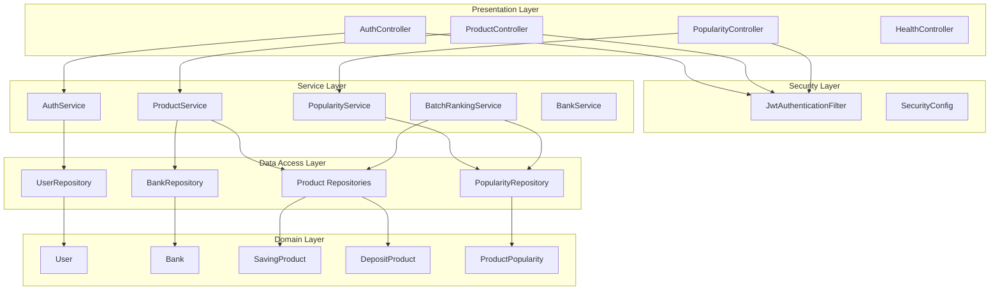
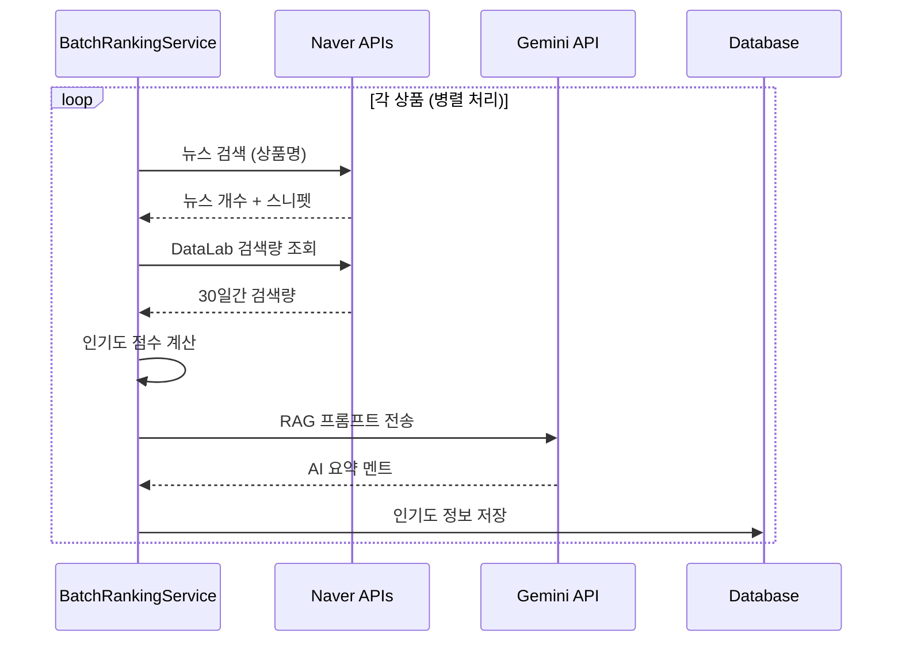
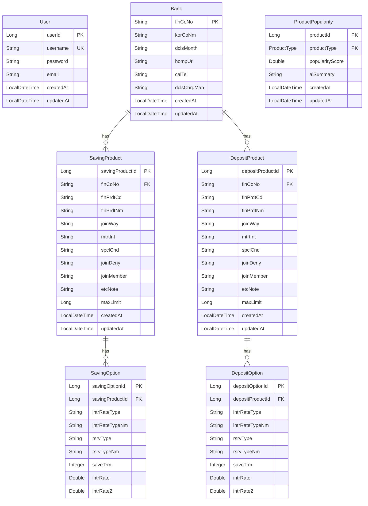
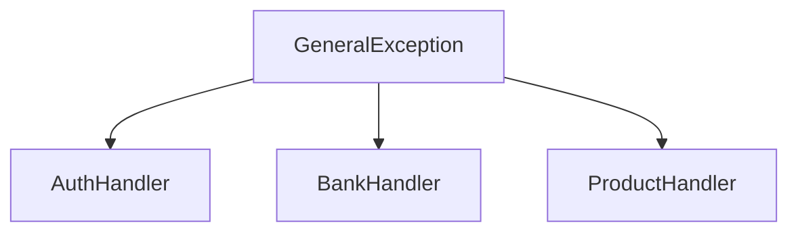

# Fini 시스템 문서화 - 설계

## 개요

Fini는 금융 상품 비교 및 추천 플랫폼으로, Spring Boot 3.5.6과 Java 17을 기반으로 구축된 RESTful API 서버입니다. 시스템은 금융감독원(FSS) API로부터 예금/적금 상품 데이터를 수집하고, 네이버 DataLab API, 네이버 News API, 그리고 Google Gemini AI를 활용하여 인기도 기반 추천 서비스를 제공합니다. RAG(Retrieval-Augmented Generation) 기법을 통해 실시간 뉴스 정보를 기반으로 한 맥락적인 추천 멘트를 생성합니다. AWS 클라우드 인프라 위에서 컨테이너 기반으로 배포되며, Terraform을 통해 인프라를 관리합니다.

**설계 결정**: 마이크로서비스 아키텍처 대신 모놀리식 구조를 채택한 이유는 초기 단계에서 개발 및 배포의 복잡도를 낮추고, 팀 규모와 트래픽 규모를 고려했을 때 충분한 성능을 제공할 수 있기 때문입니다. 향후 트래픽 증가 시 마이크로서비스로 전환할 수 있도록 레이어 간 명확한 책임 분리를 유지합니다.

## 아키텍처

### 시스템 아키텍처



### 애플리케이션 레이어 아키텍처



## 컴포넌트 및 인터페이스

### 1. 인증 및 보안 컴포넌트

#### SecurityConfig
- **역할**: Spring Security 설정 및 JWT 기반 인증 구성
- **주요 기능**:
  - CSRF 비활성화 (Stateless API)
  - 세션 정책: STATELESS
  - 개발 단계에서 모든 엔드포인트 허용 (배포 시 인증 적용 필요)
  - BCrypt 비밀번호 암호화 (기본 강도 10 rounds)
- **설계 결정**: JWT 기반 Stateless 인증을 채택하여 수평 확장이 용이하고, 세션 관리 오버헤드를 제거했습니다. BCrypt는 업계 표준 암호화 알고리즘으로 충분한 보안성을 제공하며, 기본 강도 10 rounds는 보안과 성능의 균형을 맞춘 설정입니다. 개발 단계에서 인증을 느슨하게 설정한 이유는 개발 편의성을 위함이며, 배포 전 반드시 적절한 인증/인가를 적용해야 합니다.

#### JwtUtil
- **역할**: JWT 토큰 생성, 검증, 파싱
- **주요 기능**:
  - HS256 알고리즘 사용
  - 토큰 유효기간: 1시간
  - 토큰에서 사용자명 추출
  - 토큰 유효성 검증
- **설계 결정**: 1시간의 토큰 유효기간은 보안과 사용자 편의성의 균형을 맞춘 설정입니다. 향후 Refresh Token 도입을 고려할 수 있습니다.

#### JwtAuthenticationFilter
- **역할**: HTTP 요청에서 JWT 토큰 추출 및 인증 처리
- **주요 기능**:
  - Authorization 헤더에서 Bearer 토큰 추출
  - 토큰 검증 후 SecurityContext에 인증 정보 설정

#### AuthService
- **역할**: 사용자 인증 및 계정 관리 비즈니스 로직
- **주요 메서드**:
  - `register(UserRequestDTO)`: 새로운 사용자 계정 생성
  - `login(username, password)`: 로그인 및 JWT 토큰 발급
  - `getUserInfo(username)`: 인증된 사용자 정보 조회
  - `logout()`: 로그아웃 처리 (클라이언트 측 토큰 삭제)
- **설계 결정**: 회원가입 시 중복 사용자명 검증을 수행하여 데이터 무결성을 보장합니다. 로그아웃은 서버 측에서 토큰을 무효화하지 않고 클라이언트 측에서 토큰을 삭제하는 방식으로 구현하여 Stateless 특성을 유지합니다. 향후 토큰 블랙리스트 기능을 Redis를 통해 구현할 수 있습니다.

### 2. 상품 관리 컴포넌트

#### ProductService
- **역할**: 금융 상품 데이터 동기화 및 조회
- **주요 메서드**:
  - `syncSavingProducts()`: FSS API로부터 적금 상품 동기화
  - `syncDepositProducts()`: FSS API로부터 예금 상품 동기화
  - `findSavingProducts(bankNames, terms)`: 필터링된 적금 상품 조회
  - `findDepositProducts(bankNames, terms)`: 필터링된 예금 상품 조회
  - `getSavingProductDetail(productId, optionId)`: 적금 상품 상세 조회
  - `getDepositProductDetail(productId, optionId)`: 예금 상품 상세 조회

**동기화 프로세스**:
1. FSS API 호출 (RestTemplate 사용)
2. JSON 응답을 FssProductDTO로 파싱
3. 은행 정보 확인 및 저장 (없으면 생성)
4. 상품 정보를 엔티티로 변환
5. 옵션 정보를 상품과 연관하여 저장
6. JPA를 통해 데이터베이스에 저장
7. 트랜잭션 내에서 모든 작업을 수행하여 원자성 보장

**중복 방지 메커니즘**:
- finCoNo(금융회사 코드) + finPrdtCd(상품 코드) 조합에 유니크 제약 조건 적용
- 동기화 시 기존 상품이 있으면 업데이트, 없으면 신규 생성
- **설계 결정**: FSS API에서 제공하는 고유 식별자를 활용하여 데이터 중복을 방지하고, 상품 정보 변경 시 자동으로 업데이트되도록 설계했습니다. 금융회사 코드와 상품 코드의 조합을 복합 유니크 키로 사용하는 이유는 FSS API의 데이터 구조를 그대로 반영하여 데이터 일관성을 유지하기 위함입니다.

**조회 최적화**:
- JPA Specification을 사용한 동적 쿼리 생성
- Fetch Join으로 N+1 문제 방지
- 기본 금리 내림차순 정렬
- 은행명과 저축 기간을 기준으로 한 다중 필터링 지원
- **설계 결정**: 동적 필터링 요구사항을 충족하기 위해 Specification 패턴을 사용하여 유연한 쿼리 구성이 가능하도록 했습니다. Fetch Join을 통해 상품 조회 시 옵션과 은행 정보를 한 번의 쿼리로 가져와 N+1 문제를 방지하고, 데이터베이스 부하를 최소화합니다.

#### BankService
- **역할**: 은행 정보 관리
- **주요 메서드**:
  - `syncBanks()`: FSS API로부터 은행 정보 동기화
  - `findAllBanks()`: 모든 은행 목록 조회
  - `findBankByFinCoNo(finCoNo)`: 특정 은행 조회
- **설계 결정**: 은행 정보를 별도로 관리하여 상품 데이터와의 참조 무결성을 보장하고, 은행 정보 변경 시 일괄 업데이트가 가능하도록 했습니다.

### 3. 인기도 및 추천 컴포넌트

#### BatchRankingService
- **역할**: 정기적으로 상품 인기도 점수 계산 및 AI 요약 생성
- **스케줄**: 매일 오후 8시 43분 실행 (`@Scheduled(cron = "0 43 20 * * ?")`)
- **처리 방식**:
  - 페이징 (50개 단위)
  - 병렬 스트림 (parallelStream)으로 동시 처리
- **설계 결정**: 오후 8시 43분에 실행하는 이유는 업무 시간 이후 시스템 부하가 낮은 시간대를 선택하여 사용자 경험에 영향을 최소화하기 위함입니다. 43분이라는 특정 시간을 선택한 이유는 정시나 30분 단위에 집중되는 다른 배치 작업과의 충돌을 피하기 위함입니다.

**배치 작업 흐름**:


**인기도 점수 계산 공식**:
```
최종 점수 = (최근 30일간 검색량 합계 × 1.0) + (뉴스 언급 횟수 × 0.5)
```
- **설계 결정**: 검색량에 더 높은 가중치(1.0)를 부여한 이유는 실제 사용자의 관심도를 더 직접적으로 반영하기 때문입니다. 뉴스 언급 횟수는 보조 지표로 활용하여 미디어 노출도를 고려합니다. 30일이라는 기간을 선택한 이유는 최근 트렌드를 반영하면서도 충분한 데이터 샘플을 확보하기 위함입니다. 가중치 비율(1.0 : 0.5)은 초기 설정이며, 향후 실제 데이터 분석을 통해 조정할 수 있습니다.

**RAG 프롬프트 구조**:
- 상품명
- 우대조건
- 최신 뉴스 3개의 스니펫
- AI에게 1-2줄의 추천 멘트 생성 요청
- **설계 결정**: RAG(Retrieval-Augmented Generation) 방식을 채택하여 실시간 뉴스 정보를 기반으로 한 맥락적인 추천 멘트를 생성합니다. 이는 단순한 템플릿 기반 메시지보다 사용자에게 유용한 정보를 제공합니다.

#### PopularityService
- **역할**: 인기 상품 조회 및 비교 추천
- **주요 메서드**:
  - `findPopularSavingProducts()`: 인기 적금 상품 상위 5개
  - `findPopularDepositProducts()`: 인기 예금 상품 상위 5개
  - `findSavingProductComparisons(productId)`: 적금 비교 추천
  - `findDepositProductComparisons(productId)`: 예금 비교 추천

**비교 추천 로직**:
1. 요청된 상품과 동일한 타입(적금/예금)의 상품 조회
2. 요청된 상품 자체는 결과에서 제외
3. 인기도 점수 내림차순으로 정렬
4. 각 상품의 인기도 점수와 AI 요약 포함하여 반환
- **설계 결정**: 사용자가 현재 보고 있는 상품과 비교할 수 있는 대안을 제시하여 더 나은 의사결정을 지원합니다. 적금과 예금을 별도로 비교하는 이유는 상품 특성이 다르기 때문입니다.

### 4. 데이터 초기화 컴포넌트

#### DataLoader
- **역할**: 애플리케이션 시작 시 초기 데이터 로드
- **구현**: ApplicationRunner 인터페이스
- **동작**:
  - 은행 정보 동기화 (자동 실행)
  - 상품 정보 동기화 (주석 처리됨 - 수동 API 호출 필요)
- **설계 결정**: 은행 정보는 상대적으로 변경이 적고 데이터 크기가 작아 자동 동기화하지만, 상품 정보는 데이터 양이 많고 FSS API 호출 제한이 있을 수 있어 수동 트리거 방식을 채택했습니다.

## 데이터 모델

### ERD



### 주요 엔티티 설명

#### User
- 사용자 계정 정보
- BCrypt로 암호화된 비밀번호 저장
- BaseEntity 상속 (생성/수정 시간 자동 관리)

#### Bank
- 금융기관 정보
- finCoNo를 기본 키로 사용 (FSS 제공 코드)
- 양방향 관계로 상품 목록 관리

#### SavingProduct / DepositProduct
- 적금/예금 상품 기본 정보
- finCoNo + finPrdtCd 조합으로 유니크 제약 조건
- 여러 옵션(Option)을 가질 수 있음
- ProductBase 인터페이스 구현

#### SavingOption / DepositOption
- 상품의 구체적인 금리 옵션
- 저축 기간(saveTrm), 기본 금리(intrRate), 우대 금리(intrRate2) 포함
- 단리/복리, 정액/자유적립 등의 타입 정보

#### ProductPopularity
- 상품의 인기도 점수 및 AI 요약
- 복합 기본 키: productId + productType
- 배치 작업을 통해 주기적으로 업데이트

## API 인터페이스

### 인증 API (`/api/auth`)

| 메서드 | 엔드포인트 | 설명 | 인증 필요 |
|--------|-----------|------|----------|
| POST | `/register` | 회원가입 | X |
| POST | `/login` | 로그인 (JWT 발급) | X |
| GET | `/me` | 내 정보 조회 | O |
| POST | `/logout` | 로그아웃 | O |

### 상품 API (`/api/products`)

| 메서드 | 엔드포인트 | 설명 | 인증 필요 |
|--------|-----------|------|----------|
| POST | `/sync` | 금융상품 동기화 (관리자용) | X* |
| GET | `/savings` | 적금 상품 목록 조회 | X* |
| GET | `/deposits` | 예금 상품 목록 조회 | X* |
| GET | `/savings/{productId}` | 적금 상품 상세 조회 | X* |
| GET | `/deposits/{productId}` | 예금 상품 상세 조회 | X* |

*개발 단계에서는 인증 불필요, 배포 시 인증 적용 필요

**쿼리 파라미터**:
- `bankNames`: 은행명 목록 (다중 선택 가능)
- `terms`: 저축 기간 목록 (개월 단위, 다중 선택 가능)
- `optionId`: 특정 옵션 ID (상세 조회 시)

### 추천 API (`/api/recommendations`)

| 메서드 | 엔드포인트 | 설명 | 인증 필요 |
|--------|-----------|------|----------|
| GET | `/savings` | 인기 적금 상품 TOP 5 | X* |
| GET | `/deposits` | 인기 예금 상품 TOP 5 | X* |
| GET | `/savings/compare/{productId}` | 적금 비교 추천 | X* |
| GET | `/deposits/compare/{productId}` | 예금 비교 추천 | X* |

### 헬스 체크 API

| 메서드 | 엔드포인트 | 설명 |
|--------|-----------|------|
| GET | `/health` | 서버 상태 확인 |

### 공통 응답 형식

```json
{
  "isSuccess": true,
  "code": "SUCCESS_CODE",
  "message": "성공 메시지",
  "result": {
    // 실제 데이터
  }
}
```

**설계 결정**: 모든 API 응답을 통일된 형식으로 제공하여 클라이언트의 응답 처리 로직을 단순화하고, 성공/실패 여부를 명확히 구분할 수 있도록 했습니다.

### API 문서화 (Swagger/OpenAPI)

#### SwaggerConfig
- **역할**: Swagger UI 설정 및 API 문서 자동 생성
- **제공 기능**:
  - 모든 API 엔드포인트 자동 문서화
  - 요청/응답 스키마 표시
  - 직접 API 테스트 기능 (Try it out)
  - JWT 인증 테스트 지원
- **접근 경로**: `/swagger-ui.html` 또는 `/swagger-ui/index.html`
- **설계 결정**: Swagger를 통해 API 문서를 코드와 동기화하여 항상 최신 상태를 유지하고, 개발자가 쉽게 API를 이해하고 테스트할 수 있도록 했습니다.

## 외부 API 통합

### 1. 금융감독원 API (FSS)
- **용도**: 예금/적금 상품 및 은행 정보 조회
- **인증**: API Key (쿼리 파라미터)
- **엔드포인트**:
  - 적금: `http://finlife.fss.or.kr/finlifeapi/savingProductsSearch.json`
  - 예금: `http://finlife.fss.or.kr/finlifeapi/depositProductsSearch.json`
  - 은행: `http://finlife.fss.or.kr/finlifeapi/companySearch.json`
- **호출 방식**: RestTemplate (동기)

### 2. Naver News API
- **용도**: 상품 관련 뉴스 검색 (인기도 계산 + RAG)
- **인증**: Client ID + Client Secret (헤더)
- **엔드포인트**: `https://openapi.naver.com/v1/search/news.json`
- **호출 방식**: WebClient (비동기)
- **파라미터**:
  - `query`: 검색 키워드 (은행명 + 상품명)
  - `display`: 결과 개수 (5개)

### 3. Naver DataLab API
- **용도**: 검색 트렌드 분석 (인기도 점수 계산)
- **인증**: Client ID + Client Secret (헤더)
- **엔드포인트**: `https://openapi.naver.com/datalab/search`
- **호출 방식**: WebClient (POST, 비동기)
- **파라미터**:
  - `startDate`: 조회 시작일 (30일 전)
  - `endDate`: 조회 종료일 (오늘)
  - `timeUnit`: "date"
  - `keywordGroups`: 검색 키워드 그룹

### 4. Google Gemini API
- **용도**: AI 기반 상품 추천 멘트 생성 (RAG)
- **모델**: gemini-2.5-flash
- **인증**: API Key (쿼리 파라미터)
- **엔드포인트**: `https://generativelanguage.googleapis.com/v1beta/models/gemini-2.5-flash:generateContent`
- **호출 방식**: WebClient (POST, 비동기)

## 인프라 설계

### AWS 리소스 구성

#### 컴퓨팅
- **ECS Fargate**: 컨테이너 기반 애플리케이션 실행
- **EC2**: 백업 인스턴스 (필요 시)
- **ECR**: Docker 이미지 저장소

#### 네트워킹
- **VPC**: `vpc-0e22f95d2344bf120`
- **Public Subnets**: 2개 (가용 영역 분산)
- **ALB**: 트래픽 분산 및 헬스 체크
- **CloudFront**: CDN 및 HTTPS 지원

#### 데이터
- **RDS MySQL**: 메인 데이터베이스
  - 식별자: `fini-db`
  - 서브넷 그룹: default VPC
  - 보안 그룹: 별도 구성
- **Secrets Manager**: 민감 정보 관리
  - ARN: `arn:aws:secretsmanager:ap-northeast-2:077540774425:secret:fini/app-secrets-dAkpt1`

#### 보안
- **Security Groups**: 네트워크 접근 제어
- **IAM Roles**: ECS 태스크 실행 권한

### Terraform 모듈 구조

```
terraform/
├── app/          # 애플리케이션 인프라
│   └── main.tf   # ECR, ALB, CDN, ECS, EC2
├── data/         # 데이터 인프라
│   └── main.tf   # RDS
├── dns/          # DNS 설정
│   └── main.tf   # Route53 (선택)
└── modules/      # 재사용 가능한 모듈
    ├── alb/
    ├── cdn/
    ├── ec2/
    ├── ecr/
    ├── ecs/
    └── rds/
```

### 배포 프로세스

1. Docker 이미지 빌드
2. ECR에 이미지 푸시
3. ECS 태스크 정의 업데이트
4. ECS 서비스 업데이트 (롤링 배포)
5. ALB 헬스 체크 통과 확인
6. 이전 버전 태스크 종료

**롤링 배포 전략**:
- 최소 헬스 체크 비율: 100% (무중단 배포)
- 최대 배포 비율: 200% (새 버전과 구 버전 동시 실행)
- **설계 결정**: 롤링 배포를 통해 서비스 중단 없이 새 버전을 배포하고, 문제 발생 시 빠른 롤백이 가능하도록 했습니다.

## 에러 처리

### 예외 계층 구조



### ExceptionAdvice
- `@RestControllerAdvice`를 사용한 전역 예외 처리
- 모든 예외를 ApiResponse 형식으로 변환
- 적절한 HTTP 상태 코드 반환
- **설계 결정**: 통일된 에러 응답 형식을 통해 클라이언트의 에러 처리 로직을 단순화하고, 일관된 사용자 경험을 제공합니다.

### 에러 상태 코드 (ErrorStatus)
- 인증 관련: `AUTH_*`
- 은행 관련: `BANK_*`
- 상품 관련: `PRODUCT_*`

### 외부 API 에러 처리
- **Naver API 실패**: 로그 기록 후 해당 상품의 인기도 점수를 0으로 설정
- **Gemini API 실패**: 로그 기록 후 기본 메시지("상품 정보를 확인하세요") 저장
- **FSS API 실패**: 예외 발생 및 동기화 작업 중단, 관리자에게 알림
- **설계 결정**: 외부 API 장애가 전체 시스템에 영향을 주지 않도록 격리하되, 중요한 FSS API는 명시적으로 실패 처리하여 데이터 무결성을 보장합니다.

## 테스팅 전략

### 단위 테스트
- JUnit 5 사용
- 서비스 레이어 로직 테스트
- Mock 객체를 사용한 의존성 격리
- **테스트 범위**:
  - 인증 로직 (회원가입, 로그인, JWT 검증)
  - 상품 필터링 로직
  - 인기도 점수 계산 로직
  - 에러 처리 로직

### 통합 테스트
- Spring Boot Test 사용
- 실제 데이터베이스 연동 테스트 (H2 인메모리 DB 또는 Testcontainers)
- API 엔드포인트 테스트
- **테스트 범위**:
  - 전체 API 엔드포인트 동작 검증
  - 데이터베이스 트랜잭션 및 무결성 검증
  - 인증 필터 체인 검증

### API 테스트
- Swagger UI를 통한 수동 테스트
- Postman 컬렉션 (선택)
- **설계 결정**: Swagger UI를 통해 개발자가 쉽게 API를 테스트하고 문서를 확인할 수 있도록 하여 개발 생산성을 향상시킵니다.

### 외부 API 테스트
- Mock 서버를 사용한 외부 API 응답 시뮬레이션
- 실패 시나리오 테스트 (타임아웃, 에러 응답 등)
- **설계 결정**: 외부 API 의존성을 격리하여 안정적인 테스트 환경을 구축하고, 다양한 에러 시나리오를 검증합니다.

## 성능 최적화

### 데이터베이스 최적화
1. **Fetch Join**: N+1 쿼리 문제 방지
   - 상품 조회 시 옵션 정보를 한 번의 쿼리로 가져옴
   - 은행 정보도 함께 조인하여 추가 쿼리 방지
2. **인덱스**: finCoNo, finPrdtCd 조합에 유니크 인덱스
   - 상품 조회 및 중복 체크 성능 향상
3. **배치 페치 사이즈**: 1000개
   - 컬렉션 조회 시 배치로 가져와 쿼리 수 감소
4. **커넥션 풀 설정**:
   - keepalive: 5분 (유휴 연결 유지)
   - max-lifetime: 10분 (연결 재사용 최대 시간)
   - **설계 결정**: RDS의 연결 제한을 고려하여 적절한 커넥션 풀 설정으로 안정성과 성능을 균형있게 유지합니다.

### 데이터 무결성
1. **JPA Auditing**: 엔티티의 생성/수정 시간 자동 기록
   - BaseEntity를 상속하여 모든 엔티티에 적용
   - `@CreatedDate`, `@LastModifiedDate` 어노테이션 사용
2. **트랜잭션 관리**: `@Transactional` 어노테이션으로 ACID 보장
3. **유니크 제약 조건**: 중복 데이터 방지
4. **외래 키 제약 조건**: 참조 무결성 보장
- **설계 결정**: JPA의 자동화 기능을 활용하여 데이터 무결성을 보장하고, 수동 관리로 인한 오류를 방지합니다.

### 배치 작업 최적화
1. **페이징**: 50개 단위로 처리
   - 메모리 사용량 제어
   - 대량 데이터 처리 시 안정성 확보
2. **병렬 처리**: parallelStream 사용
   - 멀티코어 CPU 활용
   - 외부 API 호출 대기 시간 단축
3. **비동기 API 호출**: WebClient 사용
   - Non-blocking I/O로 효율적인 리소스 사용
   - 동시 다발적인 외부 API 호출 처리
- **설계 결정**: 배치 작업의 특성상 대량의 외부 API 호출이 필요하므로, 병렬 처리와 비동기 호출을 조합하여 처리 시간을 최소화합니다.

### 캐싱 전략
- Redis 의존성 추가됨 (RedisConfig는 비어있음)
- **향후 캐싱 대상**:
  - 인기 상품 목록 (TTL: 1시간)
  - 은행 목록 (TTL: 24시간)
  - 상품 상세 정보 (TTL: 30분)
- **설계 결정**: 현재는 캐싱이 구현되지 않았지만, 향후 트래픽 증가 시 Redis를 활용한 캐싱으로 데이터베이스 부하를 줄이고 응답 속도를 개선할 수 있습니다.

## 보안 고려사항

### 인증 및 인가
- JWT 기반 Stateless 인증
- 토큰 유효기간: 1시간
- HTTPS 통신 (CloudFront)
- **현재 상태**: 개발 단계에서 모든 엔드포인트 허용
- **배포 시 적용 필요**:
  - 인증이 필요한 엔드포인트 보호
  - 관리자 전용 API (동기화 등) 별도 권한 설정
- **설계 결정**: 개발 편의성을 위해 초기에는 인증을 느슨하게 설정하되, 배포 전 반드시 적절한 인증/인가를 적용해야 합니다.

### 데이터 보호
- 비밀번호 BCrypt 암호화 (강도: 기본값 10 rounds)
- API Key 환경 변수 관리 (application.yaml에서 참조)
- Secrets Manager를 통한 민감 정보 관리
  - 데이터베이스 자격 증명
  - 외부 API 키 (FSS, Naver, Gemini)
- **설계 결정**: 민감 정보를 코드에서 분리하여 보안을 강화하고, AWS Secrets Manager를 통해 중앙 집중식 관리를 수행합니다.

### 네트워크 보안
- Security Group을 통한 접근 제어
  - ALB: 인터넷에서 80/443 포트만 허용
  - ECS: ALB에서만 접근 허용
  - RDS: ECS에서만 접근 허용
- VPC 내부 통신
- ALB를 통한 트래픽 필터링
- **설계 결정**: 계층별 네트워크 격리를 통해 공격 표면을 최소화하고, 최소 권한 원칙을 적용합니다.

### 입력 검증
- Spring Validation을 사용한 요청 데이터 검증
- SQL Injection 방지 (JPA 사용)
- XSS 방지 (JSON 응답)
- **설계 결정**: 프레임워크 수준의 보안 기능을 활용하여 일반적인 웹 공격을 방어합니다.

## 모니터링 및 로깅

### 로깅
- SLF4J + Logback
- 로그 레벨: INFO (기본), ERROR (예외)
- 주요 로깅 포인트:
  - API 요청/응답
  - 외부 API 호출 (성공/실패)
  - 배치 작업 진행 상황 (시작, 진행률, 완료)
  - 예외 발생 (스택 트레이스 포함)
  - 데이터베이스 쿼리 (개발 환경)
- **로그 형식**: 타임스탬프, 로그 레벨, 클래스명, 메시지
- **설계 결정**: 구조화된 로깅을 통해 문제 발생 시 빠른 원인 파악과 디버깅이 가능하도록 했습니다. 배치 작업의 경우 진행 상황을 상세히 로깅하여 모니터링을 용이하게 합니다.

### 모니터링
- **헬스 체크 엔드포인트**: `/health` - 서버 상태 확인
- **ALB 헬스 체크**: 주기적인 인스턴스 상태 확인 및 자동 복구
- **CloudWatch**: AWS 기본 제공 메트릭 (CPU, 메모리, 네트워크)
- **향후 고려사항**:
  - 커스텀 메트릭 (API 응답 시간, 에러율)
  - 알람 설정 (임계값 초과 시 알림)
  - 로그 집계 및 분석 (CloudWatch Logs Insights)
- **설계 결정**: 기본적인 모니터링 인프라를 구축하여 시스템 안정성을 확보하고, 향후 필요에 따라 확장 가능하도록 설계했습니다.

## 확장성 고려사항

### 수평 확장
- ECS Fargate를 통한 컨테이너 자동 스케일링
- ALB를 통한 트래픽 분산

### 수직 확장
- RDS 인스턴스 타입 변경
- ECS 태스크 CPU/메모리 조정

### 데이터 확장
- RDS Read Replica (읽기 부하 분산)
- Redis 캐싱 (조회 성능 향상)
